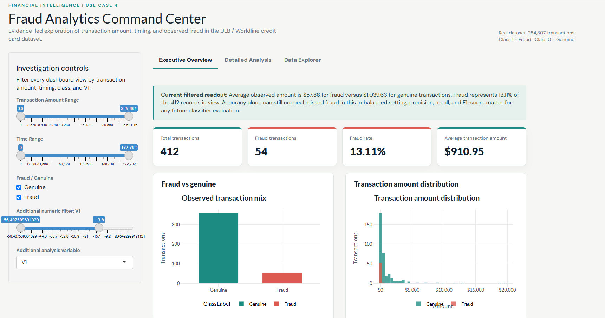
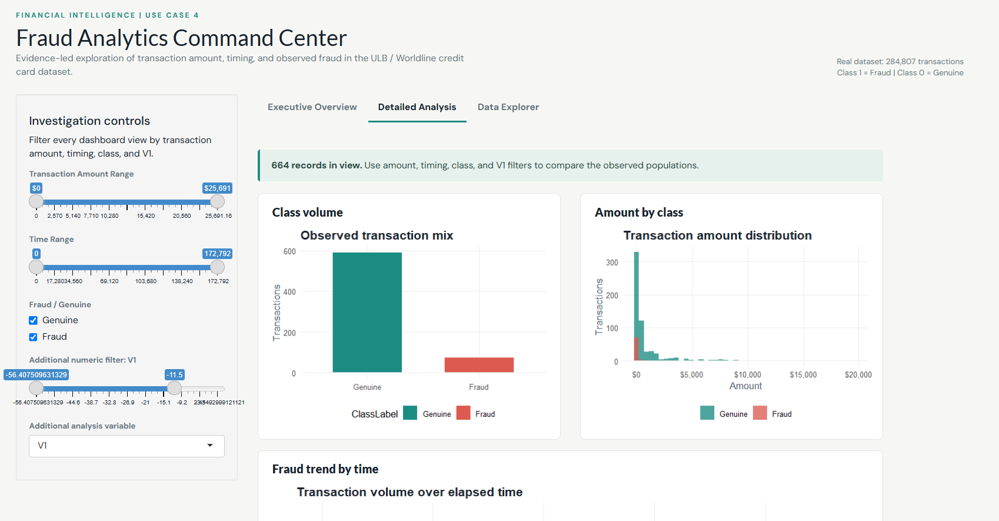
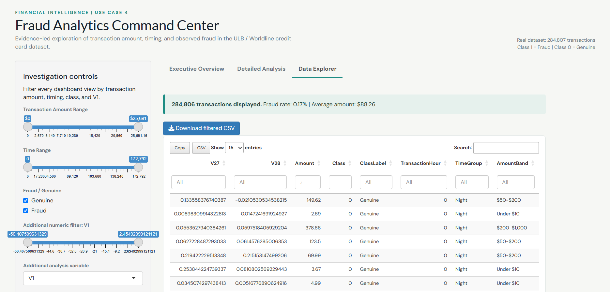

# Financial Transaction / Fraud Analytics Dashboard

An interactive **RShiny dashboard** for analyzing financial transaction patterns, comparing fraudulent and genuine transactions, exploring transaction amount and timing, and investigating characteristics associated with observed fraud.

## Overview

This project develops an interactive analytics dashboard using **R and RShiny** to explore financial transaction data from the ULB / Worldline Credit Card Fraud Detection dataset.

The dashboard helps users answer three key questions:

- How does transaction amount differ between fraudulent and genuine transactions?
- How does fraud frequency vary across elapsed time and time-of-day groups?
- Why can accuracy be misleading when fraudulent transactions are highly imbalanced?

The application provides interactive filtering, KPI cards, analytical visualizations, an interactive data explorer, and filtered-data export.

## Features

- Interactive RShiny dashboard
- Transaction amount range filtering
- Transaction time range filtering
- Fraud / Genuine class filtering
- Numerical V-variable filtering
- Reactive KPI cards
- Interactive analytical visualizations
- Fraud vs genuine transaction comparison
- Transaction amount distribution analysis
- Fraud trend analysis over time
- Fraud rate by time group
- Numerical transaction characteristic analysis
- Interactive data table with search, sorting, and pagination
- Summary statistics
- Filtered-data download
- Empty-result validation and graceful handling
- Customized dashboard UI
- Plotly interactive tooltips

## Dashboard Structure

### 1. Executive Overview

The Executive Overview provides a high-level summary of financial transaction activity through four key performance indicators:

- **Total Transactions**
- **Fraud Transactions**
- **Fraud Rate**
- **Average Transaction Amount**

It also presents key visualizations for understanding the distribution of genuine and fraudulent transactions, transaction amounts, and fraud behaviour over time.



### 2. Detailed Analysis

The Detailed Analysis tab provides interactive exploration of transaction behaviour using:

- Transaction Amount Range
- Transaction Time Range
- Fraud / Genuine Class
- V1 Numerical Filter
- Selectable V-variable for analysis

The tab includes analytical visualizations for:

- Fraud vs Genuine Transaction Volume
- Transaction Amount Distribution
- Fraud Trend by Time
- Fraud Rate by Time Group
- Selected V-variable Distribution by Class

The outputs update dynamically based on the selected filters.



### 3. Data Explorer

The Data Explorer allows users to inspect the filtered transaction dataset through an interactive table.

It provides:

- Search
- Sorting
- Pagination
- Summary statistics
- Filtered-data download



## Data Preparation

The dataset was prepared before visualization and analysis through:

- Dataset structure inspection
- Missing-value checking
- Duplicate checking
- Data-type validation and conversion
- Fraud / genuine class validation
- Suspicious and impossible-value checking
- Data transformation and aggregation
- Creation of derived analytical variables

The analysis uses the actual **Credit Card Fraud Detection dataset from ULB / Worldline**, containing transaction time, anonymized numerical variables (`V1`–`V28`), transaction amount, and transaction class.

The resulting dataset is used as the analysis-ready input for the dashboard.

## Dashboard Architecture

The application follows a layered analytics architecture:

```text
Data Layer
    ↓
Data Cleaning & Transformation
    ↓
Reactive Layer
    ↓
Visualization Layer
    ↓
Shiny User Interface
    ↓
Data Explorer & Export
```

The reactive layer dynamically updates KPIs, charts, analytical summaries, and the data table whenever users change the available filters.

## Technology Stack

- **R**
- **RShiny**
- **dplyr**
- **tidyr**
- **readr**
- **ggplot2**
- **Plotly**
- **DT**
- **scales**
- **Custom CSS**

## Project Structure

```text
fraud-analytics/
│
├── app.R
│
├── data/
│   └── dataset.csv
│
├── R/
│   ├── data_prep.R
│   ├── helpers.R
│   └── plots.R
│
├── www/
│   └── custom.css
│
├── screenshots/
│   ├── tab1_top.png
│   ├── tab2_top.png
│   └── tab3.png
│
└── README.md
```

## Running the Application

### Prerequisites

Install:
- **R**
- **RStudio**
- **Required R packages**

Install the required packages using:

```r
install.packages(c(
  "shiny",
  "dplyr",
  "tidyr",
  "readr",
  "ggplot2",
  "plotly",
  "DT",
  "scales"
))
```

### Run the Application

Open the project directory in RStudio and run:

```r
shiny::runApp()
```

Alternatively, from the project directory, the application can be launched using:

```powershell
"C:\Program Files\R\R-4.6.1\bin\Rscript.exe" -e "shiny::runApp('.')"
```

The application will open in the default web browser.

## Analytical Questions

The dashboard is designed to support analysis of:

- **Transaction Amount** – Examine how transaction amounts differ between fraudulent and genuine transactions.
- **Fraud Timing** – Explore how fraudulent transactions vary across elapsed time and time-of-day groups.
- **Class Imbalance** – Understand why accuracy alone is insufficient when fraud represents a very small proportion of transactions.
- **Transaction Characteristics** – Investigate differences in the anonymized numerical transaction variables between the two observed classes.

## Interactivity

The dashboard provides multiple interactive controls that allow users to dynamically explore different subsets of the transaction dataset.
Changes to the selected filters automatically update the relevant:

- KPI values
- Charts
- Analytical summaries
- Data Explorer table

This reactive behaviour allows users to perform exploratory analysis without manually re-running data-processing operations.

## Data Explorer and Export

The Data Explorer provides direct access to the filtered transaction dataset.
Users can:

- Search for records
- Sort columns
- Navigate through pages
- View summary information
- Download filtered data

This connects the visual analysis with the underlying transaction data and allows selected records to be used for further analysis.

## Validation

The dashboard handles filter combinations that produce no matching records gracefully without crashing the application.
The reactive outputs are updated according to the current filter selections, maintaining consistency between the KPIs, visualizations, analytical summaries, and Data Explorer.

## Key Analytical Areas

The dashboard supports analysis of:

- Fraudulent vs genuine transactions
- Transaction amount distribution
- Fraud transaction frequency
- Fraud rate over time
- Time-of-day transaction patterns
- Numerical transaction characteristics
- Class imbalance
- Exploratory fraud analysis

The dashboard is intended for exploratory analytics and does not perform production fraud prediction or classification.

## Conclusion

The Fraud Analytics – Financial Transaction / Fraud Analytics Dashboard provides an interactive platform for exploring financial transaction patterns using RShiny.
By combining data preparation, reactive filtering, KPI analysis, interactive visualization, data exploration, validation, and export functionality, the dashboard enables users to investigate differences between observed fraudulent and genuine transactions from multiple perspectives.
The application demonstrates the use of RShiny for developing a complete interactive analytics solution rather than relying only on static fraud-related visualizations.
